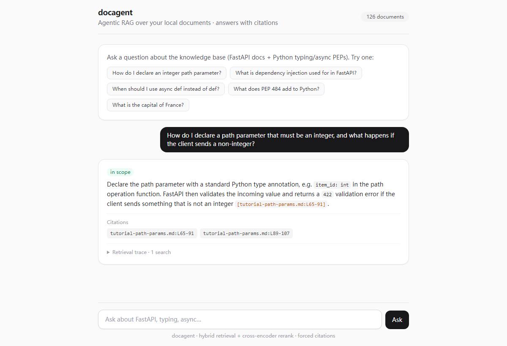
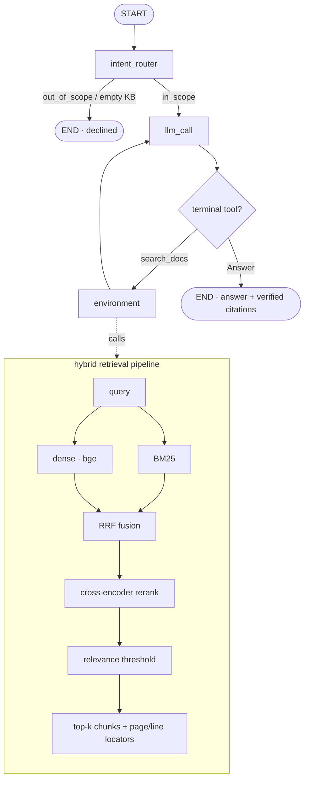

# docagent — chat with your papers, fully local

**English** | [中文](README.zh-CN.md)

Ask questions across a pile of papers (or any local docs) and get answers with
**page-precise, verified citations** — running **entirely on your machine**. Built
on [LangGraph](https://langchain-ai.github.io/langgraph/).

Cloud paper tools (ChatPDF, Elicit, …) make you **upload your PDFs**. docagent
doesn't: embeddings run locally, papers never leave your disk (`papers/` is
gitignored), and you can even run the answer model locally via Ollama. What you
get back is grounded — every citation is checked against what was actually
retrieved, down to the **PDF page**.

## Why it's different

- 🔒 **Fully local / private** — your PDFs are never uploaded; local embeddings,
  optional local LLM (Ollama). Good for unpublished or sensitive papers.
- 📎 **Page-precise, verified citations** — answers cite `paper.pdf (p.3)`; cited
  locators are **checked against retrieval**, hallucinated ones are dropped.
- 🔗 **Cross-paper synthesis** — the agent searches, re-queries, and combines
  facts from multiple papers in one answer.
- 🙅 **Honest refusal** — if the papers don't cover it, it says so (relevance
  threshold), instead of making something up.
- 🧪 **Real retrieval** — hybrid dense (bge) + BM25 → RRF → cross-encoder rerank.
- 💬 **CLI + Web UI**, 🔭 **retrieval trace**, 📊 **eval harness**, multi-format
  (PDF / Markdown / RST / text).

## Quickstart

```bash
# 1. Environment (Python 3.11)
conda create -n docagent python=3.11 -c conda-forge
conda activate docagent
pip install -e .

# 2. Answer LLM: put OPENAI_API_KEY in .env — or go fully local:
cp .env.example .env
#   pip install -e ".[ollama]"  &&  set LLM_MODEL=ollama:llama3.1 in .env

# 3. Get some papers (downloaded locally, never uploaded) and index them
python scripts/fetch_arxiv.py --demo          # 8 papers: Attention, RAG, BERT, T5, RoBERTa, DPR, SBERT, GPT-3
#   or: python scripts/fetch_arxiv.py 1706.03762 2005.11401  (any arXiv ids)
python -m docagent.ingest --path ./papers --reset

# 4. Ask
python -m docagent.ask --trace "How is BERT related to the Transformer?"
#   multi-turn chat (follow-ups remember earlier turns):
python -m docagent.chat
#   or the web UI:
python -m docagent.web        # http://127.0.0.1:8000
```

Point `ingest --path` at any folder of your own `.pdf` / `.md` / `.rst` / `.txt`.

## Example run

A **cross-paper** question — the agent searches, lists sources, re-queries, then
answers from two papers with page citations (real output):

```console
$ python -m docagent.ask --trace "How does retrieval-augmented generation use a retriever, and how is BERT related to the Transformer architecture?"
🔎 Intent: IN_SCOPE — retrieving from knowledge base
=== trace ===
  1. search_docs  query='retrieval-augmented generation retriever BERT Transformer architecture'
  2. list_sources
  3. search_docs  query='BERT Transformer architecture bidirectional encoder layers'

=== Answer ===
RAG uses a retriever to access a dense vector index … the retriever provides
latent documents conditioned on the input, and the model marginalizes over
seq2seq predictions given different retrieved documents
[retrieval-augmented-generation.pdf (p.1); retrieval-augmented-generation.pdf (p.2)].
BERT is a multi-layer bidirectional Transformer encoder, based on the original
Transformer [bert.pdf (p.1); bert.pdf (p.3)].

=== Citations ===
- retrieval-augmented-generation.pdf (p.1)
- bert.pdf (p.1)
- bert.pdf (p.3)
```

Out-of-scope questions are declined; offline, `python scripts/check_retrieval.py`
shows the raw retrieval stack with no API key.

## Web UI



A small chat front-end (FastAPI + a static Tailwind page) showing the answer, the
intent badge, citation chips, dropped (unsupported) citations, and a collapsible
retrieval trace. `python -m docagent.web` → http://127.0.0.1:8000.

API:
- `POST /api/ask {question, session_id?, collection?}` → `{kind, intent, answer, question, citations, unsupported, trace}`
- `POST /api/ask/stream` — same body, Server-Sent Events: a `step` event per graph node, then a `final` event
- `GET /api/sources {collection?}` → `{sources}`; `GET /health` → `{status}`

Pass a stable `session_id` to hold a multi-turn conversation (per-thread
checkpointer), and `collection` to serve several knowledge bases from one server.
Set `DOCAGENT_API_KEY` to require `X-API-Key` on `/api/*`, and
`RATE_LIMIT_REQUESTS` / `RATE_LIMIT_WINDOW` for a per-client rate limit.

### Docker

```bash
docker build -t docagent .
# ingest into a mounted volume, then serve it:
docker run --rm -v $PWD/papers:/papers -v $PWD/chroma_db:/data/chroma docagent \
  python -m docagent.ingest --path /papers --reset
docker run -p 8000:8000 -v $PWD/chroma_db:/data/chroma -e OPENAI_API_KEY=sk-... docagent
```

## Architecture



The agent is built by `build_agent(config)` — no model/reranker is initialised at
import time; tools are bound to the configured retriever (`make_retrieval_tools`).

## Evaluation

The eval set is a curated, **category-labelled** QA dataset in
`src/docagent/eval/data/qa_cases.jsonl` (one JSON row per case). Each row carries
an `intent`, a `category` (`single_paper` / `multi_hop` / `numeric` /
`definitional` / `out_of_scope` / `no_answer`), gold `expected_sources`, an
LLM-judged `criteria`, and a `split`:

- `offline_sample` — answerable from the bundled `sample_notes/`; runs with no
  paper download (used by the offline LLM test suite).
- `full_corpus` — needs the downloaded `papers/`; the manual / nightly eval.

**Grow the set (generate → curate → eval):**

```bash
python scripts/fetch_arxiv.py --demo && python -m docagent.ingest --path ./papers --reset
python scripts/generate_qa.py --n-per-category 25   # LLM-drafts candidates from real chunks
#   -> review src/docagent/eval/data/generated_raw.jsonl, set curated=true,
#      and merge good rows into qa_cases.jsonl
python -m docagent.eval.run_eval                    # full_corpus, per-category table
python -m docagent.eval.run_eval --split offline_sample --categories multi_hop
```

`run_eval` reports every metric **overall and broken down by category** (the
per-category view is what lets a change prove it actually helps, e.g. multi-hop),
and writes a machine-readable `eval_results.json` baseline for tracking deltas.

The curated set holds **~90 cases** across 6 categories, over 5 bundled sample
notes (`offline_sample`) and 8 demo papers (`full_corpus`). Latest `offline_sample`
run (59 cases):

| Metric | Result |
|---|---|
| Intent routing accuracy | **100%** (53/53) |
| Retrieval recall (mean) | **0.91** |
| Answer correctness (LLM-judged) | **98%** (44/45) |
| Citation grounding | **100%** (45/45) |
| Hallucinated citations | **0** |
| Refusal accuracy | **100%** (8/8) |

Per category (recall / answer correctness):

| Category | n | recall | answer |
|---|---|---|---|
| single_paper | 24 | 0.92 | 0.95 |
| definitional | 16 | 1.00 | 1.00 |
| multi_hop | 7 | 0.64 | 1.00 |
| numeric | 4 | 1.00 | 1.00 |
| out_of_scope | 3 | — | refusal 1.00 |
| no_answer | 5 | — | refusal 1.00 |

> Multi-hop is the hardest — retrieval recall 0.64 (it must surface every passage
> a question needs), yet answers and citations still came out correct. Numbers
> depend on the answer model behind `LLM_MODEL`; re-run `run_eval` for your own.

## Limitations

Portfolio-grade local RAG, not a production system. Known limits:

- **Corpus scale** — the retriever loads all chunks and builds BM25 in memory at
  startup; fine for a personal paper library (≤ ~10k chunks), not 10⁵–10⁶.
- **Citation verification is source/page-level** — checked against retrieved
  locators, not yet per-sentence entailment of the cited span.
- **Multi-hop** — questions needing several papers at once are the hardest case.
- **Eval breadth** — the eval set is now a curated, category-labelled JSONL with a
  generator (`scripts/generate_qa.py`), but broad generalisation still depends on
  running generation + human curation over a larger corpus; the committed seed is
  intentionally small.

## Project layout

```
src/docagent/
├── agent.py            # LangGraph factory: intent_router + response loop + trace
├── retriever.py        # hybrid: dense+BM25 -> RRF -> rerank -> threshold
├── ingest.py           # load -> chunk (+page/line provenance) -> embed -> Chroma
├── ask.py / web.py     # CLI / FastAPI + static web UI
├── tools/              # make_retrieval_tools(retriever, cfg); Answer, Question
├── utils.py            # extract_outcome(): citation verification
└── eval/               # data/qa_cases.jsonl (dataset) + qa_dataset.py (loader) + run_eval.py
scripts/                # fetch_arxiv.py · generate_qa.py · check_retrieval.py · calibrate_threshold.py
sample_notes/           # bundled offline corpus (CI / quick try; no download)
tests/                  # test_unit.py (offline) + test_retrieval.py + test_response.py
```

## Testing

```bash
python tests/run_all_tests.py          # offline retrieval tests (no API key)
python tests/run_all_tests.py --all    # + LLM end-to-end (needs key + ingested papers)
```

CI runs ruff, offline unit tests (no network/model), retrieval tests over
`sample_notes`, and a wheel-packages-the-UI smoke test.

## Configuration

`.env` (see `.env.example`): `OPENAI_API_KEY`, `LLM_MODEL` (default
`openai:gpt-4.1`; any `init_chat_model` id incl. `ollama:llama3.1`),
`EMBEDDING_MODEL` (`BAAI/bge-small-en-v1.5`), `RERANKER_MODEL`,
`TOP_K`/`CANDIDATE_K`, `SCORE_THRESHOLD` (calibrated; see
`scripts/calibrate_threshold.py`), `CHROMA_PATH`/`CHROMA_COLLECTION`.

## Tech stack

LangGraph · LangChain · Chroma · sentence-transformers (bge) · rank-bm25 ·
cross-encoder · pypdf · FastAPI · Tailwind

## License

MIT. Demo papers are downloaded from arXiv locally and are **not** redistributed
in this repo; they remain under their authors' terms.
