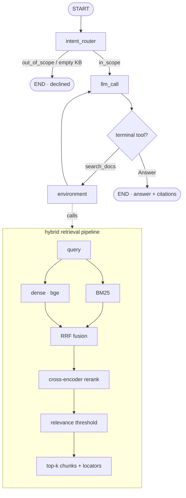

# docagent — agentic RAG over your local documents

**English** | [中文](README.zh-CN.md)

Ask natural-language questions over a real documentation corpus and get answers
that **cite their exact source location** (file + line range, or PDF page). Built
on [LangGraph](https://langchain-ai.github.io/langgraph/), with a hybrid
retrieval pipeline, a quantitative eval harness, and a small web UI.

The bundled knowledge base is themed: **Modern Python Web Development** — the
FastAPI docs plus the Python typing/async PEPs they build on — across **Markdown,
reStructuredText, and PDF** (127 documents / ~1.25k chunks).

## Features

- 🔁 **Agentic retrieval** — search, inspect, reformulate, search again, then answer.
- 🧪 **Hybrid retrieval + rerank** — dense (bge) **+** BM25 fused with RRF, then a
  cross-encoder rerank, then a relevance threshold (also how it says "not in the docs").
- 🗂️ **Multi-format** — Markdown, reStructuredText, and PDF in one knowledge base,
  each citation carrying the right locator (`file.md:L10-30` or `file.pdf (p.3)`).
- 📎 **Precise, forced citations** — the `Answer` tool *requires* citations.
- 🧭 **Intent routing**, 🔭 **retrieval trace** (`--trace`), 🛡️ **robustness**
  (empty-KB / tool-failure / recursion guards).
- 📊 **Quantitative evaluation** — intent / recall / answer / citation / refusal.
- 💬 **Web UI** — a small FastAPI + static chat front-end.
- 🔒 **Local embeddings, no API key** for retrieval; only the answer LLM needs one.

## Architecture



## Quickstart

```bash
# 1. Environment (Python 3.11)
conda create -n docagent python=3.11 -c conda-forge
conda activate docagent
pip install -e .

# 2. Configure the answer LLM
cp .env.example .env          # put OPENAI_API_KEY in .env (or LLM_MODEL=ollama:llama3.1)

# 3. Build the corpus (FastAPI docs + PEPs + a PDF) and index it
python scripts/build_corpus.py
python -m docagent.ingest --path ./corpus --reset

# 4a. Ask from the CLI
python -m docagent.ask --trace "How do I declare an integer path parameter?"

# 4b. …or launch the web UI
python -m docagent.web        # open http://127.0.0.1:8000
```

Point `ingest --path` at any folder of your own `.md` / `.rst` / `.txt` / `.pdf`
files to build a knowledge base over your own documents.

## Web UI


A small chat front-end (FastAPI backend + a static Tailwind page) shows the
answer, the intent badge, citation chips, and a collapsible retrieval trace:

```bash
python -m docagent.web   # http://127.0.0.1:8000
```

API: `POST /api/ask {question}` → `{intent, answer, citations, trace}`,
`GET /api/sources` → the document list.

## Example run

**Cross-format retrieval** (the probe, no API key — `python scripts/check_retrieval.py`):

```console
Q: What does PEP 484 specify about type hints?
   pep-0484.rst:L1-25                 score= 5.42  'PEP: 484 Title: Type Hints ...'
Q: What are protocols and structural subtyping?
   pep-0544-protocols.pdf (p.1)       score= 5.07  'PEP: 544 Title: Protocols: Structural subtyping ...'
Q: What is the capital of France?
   (no chunk passed the relevance threshold)
```

**In-scope question** (CLI):

```console
$ python -m docagent.ask --trace "How do I declare a path parameter that must be an integer, and what does FastAPI do if the client sends a non-integer?"
🔎 Intent: IN_SCOPE — retrieving from knowledge base
=== trace ===
  1. search_docs  query='FastAPI path parameter integer non-integer validation'

=== Answer ===
Declare the path parameter with a Python type annotation, e.g. `item_id: int`.
FastAPI validates it and returns a validation error for a non-integer
[tutorial-path-params.md:L65-91].

=== Citations ===
- tutorial-path-params.md:L65-91
```

## Corpus

Themed, multi-format, reproducible:

| Source | Format | Count | License |
|---|---|---|---|
| FastAPI docs (tutorial / advanced / how-to / deployment) | Markdown | 119 | MIT |
| Python PEPs (484, 492, 8, 257, 20, 585, 604) | reStructuredText | 7 | PSF |
| PEP 544 (Protocols) rendered to PDF | PDF | 1 | PSF |

Rebuild any time with `python scripts/build_corpus.py` (see `corpus/SOURCE.md`
for attribution).

## Retrieval pipeline

`search_docs` is not naive top-k cosine. Per query: **dense** (`bge-small-en-v1.5`)
+ **BM25** → **RRF fusion** → **cross-encoder rerank** (`ms-marco-MiniLM-L-6-v2`)
→ **relevance threshold**. Each surviving chunk keeps a precise locator for citation.

## Evaluation

A labelled QA set (`src/docagent/eval/qa_dataset.py`) covers single-doc,
multi-hop, out-of-scope, and unanswerable questions:

```bash
python -m docagent.eval.run_eval
```

Latest run over the bundled corpus (~1.25k chunks / 126 docs), answer LLM
`gpt-5.4-mini`:

| Metric | Result |
|---|---|
| Intent routing accuracy | **10/10 (100%)** |
| Retrieval recall (mean) | **0.94** |
| Answer correctness (LLM-judged) | **7/8 (88%)** |
| Citation grounding | **8/8 (100%)** |
| Refusal accuracy | **2/2 (100%)** |

> When the corpus grew **6× (206 → ~1.25k chunks)**, retrieval quality held and
> citation grounding rose to 100% — the hybrid retrieval + rerank scales. The
> remaining gap is multi-hop synthesis (one question needs two documents at once).

## Project layout

```
src/docagent/
├── agent.py            # LangGraph: intent_router + response loop + trace/guards
├── retriever.py        # hybrid: dense+BM25 -> RRF -> rerank -> threshold
├── ingest.py           # load -> chunk (+line/page provenance) -> embed -> Chroma
├── ask.py / web.py     # CLI / FastAPI+static web UI
├── static/index.html   # chat front-end (Tailwind)
├── vectorstore.py, configuration.py, prompts.py, schemas.py
├── tools/              # search_docs, list_sources, Answer, Question
└── eval/               # qa_dataset.py + run_eval.py
corpus/{fastapi,peps,pdf}/   # themed multi-format demo corpus
scripts/                # build_corpus.py, check_retrieval.py, check_web.py
tests/                  # retrieval tests (no key) + LLM end-to-end tests
```

## Testing

```bash
python tests/run_all_tests.py          # retrieval tests only (no API key)
python tests/run_all_tests.py --all    # + LLM end-to-end (needs API key)
```

## Configuration

Key settings in `.env` (see `.env.example`): `OPENAI_API_KEY`, `LLM_MODEL`
(default `openai:gpt-4.1`; any `init_chat_model` id), `EMBEDDING_MODEL`
(`BAAI/bge-small-en-v1.5`), `RERANKER_MODEL`
(`cross-encoder/ms-marco-MiniLM-L-6-v2`), `TOP_K`/`CANDIDATE_K` (`4`/`20`),
`SCORE_THRESHOLD` (`0.0`), `CHROMA_PATH`/`CHROMA_COLLECTION`,
`CHUNK_SIZE`/`CHUNK_OVERLAP`.

## Tech stack

LangGraph · LangChain · Chroma · sentence-transformers (bge) · rank-bm25 ·
cross-encoder · pypdf · FastAPI · Tailwind

## License

MIT (this project). The demo corpus under `corpus/` redistributes FastAPI docs
(MIT) and Python PEPs (PSF) — see `corpus/SOURCE.md`.
