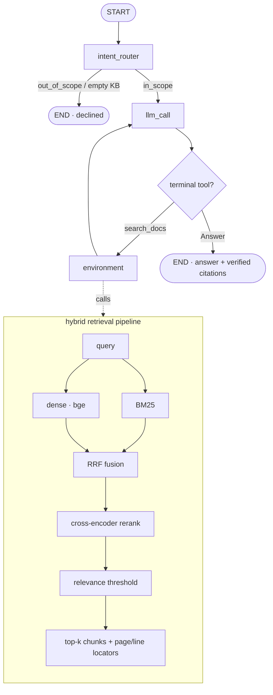

# docagent — chat with your papers, fully local

**English** | [中文](README.zh-CN.md)

Ask questions across a pile of papers (or any local docs) and get answers with
**page-precise, verified citations** — running **entirely on your machine**. Built
on [LangGraph](https://langchain-ai.github.io/langgraph/).

Cloud paper tools (ChatPDF, Elicit, …) make you **upload your PDFs**. docagent
doesn't: embeddings run locally, papers never leave your disk (`papers/` is
gitignored), and you can even run the answer model locally via Ollama. What you
get back is grounded — every citation is checked against what was actually
retrieved, down to the **PDF page**.

## Why it's different

- 🔒 **Fully local / private** — your PDFs are never uploaded; local embeddings,
  optional local LLM (Ollama). Good for unpublished or sensitive papers.
- 📎 **Page-precise, verified citations** — answers cite `paper.pdf (p.3)`; cited
  locators are **checked against retrieval**, hallucinated ones are dropped.
- 🔗 **Cross-paper synthesis** — the agent searches, re-queries, and combines
  facts from multiple papers in one answer.
- 🙅 **Honest refusal** — if the papers don't cover it, it says so (relevance
  threshold), instead of making something up.
- 🧪 **Real retrieval** — hybrid dense (bge) + BM25 → RRF → cross-encoder rerank.
- 💬 **CLI + Web UI**, 🔭 **retrieval trace**, 📊 **eval harness**, multi-format
  (PDF / Markdown / RST / text).

## Quickstart

```bash
# 1. Environment (Python 3.11)
conda create -n docagent python=3.11 -c conda-forge
conda activate docagent
pip install -e .

# 2. Answer LLM: put OPENAI_API_KEY in .env — or go fully local:
cp .env.example .env
#   pip install -e ".[ollama]"  &&  set LLM_MODEL=ollama:llama3.1 in .env

# 3. Get some papers (downloaded locally, never uploaded) and index them
python scripts/fetch_arxiv.py --demo          # Attention, RAG, BERT
#   or: python scripts/fetch_arxiv.py 1706.03762 2005.11401  (any arXiv ids)
python -m docagent.ingest --path ./papers --reset

# 4. Ask
python -m docagent.ask --trace "How is BERT related to the Transformer?"
#   or the web UI:
python -m docagent.web        # http://127.0.0.1:8000
```

Point `ingest --path` at any folder of your own `.pdf` / `.md` / `.rst` / `.txt`.

## Example run

A **cross-paper** question — the agent searches, lists sources, re-queries, then
answers from two papers with page citations (real output):

```console
$ python -m docagent.ask --trace "How does retrieval-augmented generation use a retriever, and how is BERT related to the Transformer architecture?"
🔎 Intent: IN_SCOPE — retrieving from knowledge base
=== trace ===
  1. search_docs  query='retrieval-augmented generation retriever BERT Transformer architecture'
  2. list_sources
  3. search_docs  query='BERT Transformer architecture bidirectional encoder layers'

=== Answer ===
RAG uses a retriever to access a dense vector index … the retriever provides
latent documents conditioned on the input, and the model marginalizes over
seq2seq predictions given different retrieved documents
[retrieval-augmented-generation.pdf (p.1); retrieval-augmented-generation.pdf (p.2)].
BERT is a multi-layer bidirectional Transformer encoder, based on the original
Transformer [bert.pdf (p.1); bert.pdf (p.3)].

=== Citations ===
- retrieval-augmented-generation.pdf (p.1)
- bert.pdf (p.1)
- bert.pdf (p.3)
```

Out-of-scope questions are declined; offline, `python scripts/check_retrieval.py`
shows the raw retrieval stack with no API key.

## Web UI


A small chat front-end (FastAPI + a static Tailwind page) showing the answer, the
intent badge, citation chips, dropped (unsupported) citations, and a collapsible
retrieval trace. `python -m docagent.web` → http://127.0.0.1:8000.

API: `POST /api/ask {question}` → `{kind, intent, answer, question, citations, unsupported, trace}`.

## Architecture



The agent is built by `build_agent(config)` — no model/reranker is initialised at
import time; tools are bound to the configured retriever (`make_retrieval_tools`).

## Evaluation

Labelled QA over the demo papers (`src/docagent/eval/qa_dataset.py`): single-paper,
multi-hop, out-of-scope, and unanswerable questions.

```bash
python scripts/fetch_arxiv.py --demo && python -m docagent.ingest --path ./papers --reset
python -m docagent.eval.run_eval
```

| Metric | Result |
|---|---|
| Intent routing accuracy | **8/8 (100%)** |
| Retrieval recall (mean) | **0.92** |
| Answer correctness (LLM-judged) | **6/6 (100%)** |
| Citation grounding | **6/6 (100%)** |
| Hallucinated citations | **0** |
| Refusal accuracy | **2/2 (100%)** |

> Over the 3 demo papers (220 chunks). The hardest case is multi-hop — recall 0.50
> on the one question that needs two papers at once, though its answer/citation
> still came out correct.

## Limitations

Portfolio-grade local RAG, not a production system. Known limits:

- **Corpus scale** — the retriever loads all chunks and builds BM25 in memory at
  startup; fine for a personal paper library (≤ ~10k chunks), not 10⁵–10⁶.
- **Citation verification is source/page-level** — checked against retrieved
  locators, not yet per-sentence entailment of the cited span.
- **Multi-hop** — questions needing several papers at once are the hardest case.
- **Eval set is small** (8 cases over 3 papers) — it exercises the pipeline, it
  doesn't prove broad generalisation.

## Project layout

```
src/docagent/
├── agent.py            # LangGraph factory: intent_router + response loop + trace
├── retriever.py        # hybrid: dense+BM25 -> RRF -> rerank -> threshold
├── ingest.py           # load -> chunk (+page/line provenance) -> embed -> Chroma
├── ask.py / web.py     # CLI / FastAPI + static web UI
├── tools/              # make_retrieval_tools(retriever, cfg); Answer, Question
├── utils.py            # extract_outcome(): citation verification
└── eval/               # qa_dataset.py + run_eval.py
scripts/                # fetch_arxiv.py · check_retrieval.py · calibrate_threshold.py
sample_notes/           # bundled offline corpus (CI / quick try; no download)
tests/                  # test_unit.py (offline) + test_retrieval.py + test_response.py
```

## Testing

```bash
python tests/run_all_tests.py          # offline retrieval tests (no API key)
python tests/run_all_tests.py --all    # + LLM end-to-end (needs key + ingested papers)
```

CI runs ruff, offline unit tests (no network/model), retrieval tests over
`sample_notes`, and a wheel-packages-the-UI smoke test.

## Configuration

`.env` (see `.env.example`): `OPENAI_API_KEY`, `LLM_MODEL` (default
`openai:gpt-4.1`; any `init_chat_model` id incl. `ollama:llama3.1`),
`EMBEDDING_MODEL` (`BAAI/bge-small-en-v1.5`), `RERANKER_MODEL`,
`TOP_K`/`CANDIDATE_K`, `SCORE_THRESHOLD` (calibrated; see
`scripts/calibrate_threshold.py`), `CHROMA_PATH`/`CHROMA_COLLECTION`.

## Tech stack

LangGraph · LangChain · Chroma · sentence-transformers (bge) · rank-bm25 ·
cross-encoder · pypdf · FastAPI · Tailwind

## License

MIT. Demo papers are downloaded from arXiv locally and are **not** redistributed
in this repo; they remain under their authors' terms.
