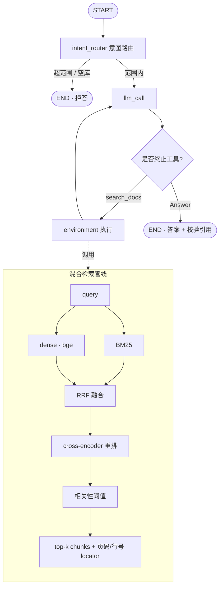

# docagent — 本地论文研究助手

[English](README.md) | **中文**

针对一堆论文(或任意本地文档)提问,得到**精确到页码、且经过校验的引用**答案 —— **全程在本机运行**。基于 [LangGraph](https://langchain-ai.github.io/langgraph/)。

云端论文工具(ChatPDF、Elicit……)要你**上传 PDF**。docagent 不用:embedding 本地跑,论文不出本机(`papers/` 已 gitignore),作答模型也可用 Ollama 本地跑。返回的答案是有据的 —— 每条引用都对照实际检索内容校验,精确到 **PDF 页码**。

## 凭什么不一样

- 🔒 **全本地 / 隐私** —— PDF 绝不上传;本地 embedding,可选本地 LLM(Ollama)。适合未发表或敏感论文。
- 📎 **精确到页、且校验过的引用** —— 答案引用 `paper.pdf (p.3)`;引用 locator **对照检索校验**,幻觉的会被丢弃。
- 🔗 **跨论文综合** —— agent 自主检索、改写查询、把多篇论文的事实综合进一个答案。
- 🙅 **诚实拒答** —— 论文里没有就说没有(相关性阈值),不编。
- 🧪 **真检索** —— 混合 dense(bge)+ BM25 → RRF → cross-encoder 重排。
- 💬 **CLI + Web UI**、🔭 **检索 trace**、📊 **评估**,多格式(PDF / Markdown / RST / 文本)。

## 快速开始

```bash
# 1. 环境（Python 3.11）
conda create -n docagent python=3.11 -c conda-forge
conda activate docagent
pip install -e .

# 2. 作答 LLM：把 OPENAI_API_KEY 填进 .env —— 或完全本地：
cp .env.example .env
#   pip install -e ".[ollama]"  且在 .env 设 LLM_MODEL=ollama:llama3.1

# 3. 拉论文（本地下载，绝不上传）并建索引
python scripts/fetch_arxiv.py --demo          # 8 篇：Attention、RAG、BERT、T5、RoBERTa、DPR、SBERT、GPT-3
#   或：python scripts/fetch_arxiv.py 1706.03762 2005.11401  （任意 arXiv id）
python -m docagent.ingest --path ./papers --reset

# 4. 提问
python -m docagent.ask --trace "How is BERT related to the Transformer?"
#   或 Web UI：
python -m docagent.web        # http://127.0.0.1:8000
```

把 `ingest --path` 指向任意装有你自己 `.pdf` / `.md` / `.rst` / `.txt` 的文件夹即可。

## 运行示例

一个**跨论文**问题 —— agent 检索、列出来源、改写再检索,然后从两篇论文带页码作答(真实输出):

```console
$ python -m docagent.ask --trace "How does retrieval-augmented generation use a retriever, and how is BERT related to the Transformer architecture?"
🔎 Intent: IN_SCOPE — retrieving from knowledge base
=== trace ===
  1. search_docs  query='retrieval-augmented generation retriever BERT Transformer architecture'
  2. list_sources
  3. search_docs  query='BERT Transformer architecture bidirectional encoder layers'

=== Answer ===
RAG uses a retriever to access a dense vector index … the model marginalizes over
seq2seq predictions given different retrieved documents
[retrieval-augmented-generation.pdf (p.1); retrieval-augmented-generation.pdf (p.2)].
BERT is a multi-layer bidirectional Transformer encoder, based on the original
Transformer [bert.pdf (p.1); bert.pdf (p.3)].

=== Citations ===
- retrieval-augmented-generation.pdf (p.1)
- bert.pdf (p.1)
- bert.pdf (p.3)
```

超范围问题会被拒答;离线时 `python scripts/check_retrieval.py` 可无 key 查看检索栈。

## Web UI


小型聊天前端(FastAPI + 静态 Tailwind),展示答案、意图徽章、引用 chips、被丢弃的未支撑引用、可折叠检索 trace。`python -m docagent.web` → http://127.0.0.1:8000。

API:`POST /api/ask {question}` → `{kind, intent, answer, question, citations, unsupported, trace}`。

## 架构



agent 由 `build_agent(config)` 构建 —— import 时不初始化任何模型/reranker;工具绑定到配置好的 retriever(`make_retrieval_tools`)。

## 评估

评估集是一个**带类别标注**的 QA 数据集 `src/docagent/eval/data/qa_cases.jsonl`(每行一个 JSON)。每行带 `intent`、`category`(`single_paper` / `multi_hop` / `numeric` / `definitional` / `out_of_scope` / `no_answer`)、黄金 `expected_sources`、LLM 评判用的 `criteria`,以及 `split`:

- `offline_sample` —— 答案落在内置 `sample_notes/`,无需下载论文即可跑(离线 LLM 测试用)。
- `full_corpus` —— 需下载 `papers/`,手动 / nightly 评估。

**扩充评测集(生成 → 精校 → 评估):**

```bash
python scripts/fetch_arxiv.py --demo && python -m docagent.ingest --path ./papers --reset
python scripts/generate_qa.py --n-per-category 25   # 用真实 chunk 让 LLM 起草候选题
#   -> 审阅 src/docagent/eval/data/generated_raw.jsonl，把好题 curated=true 后并入 qa_cases.jsonl
python -m docagent.eval.run_eval                    # full_corpus，输出按类别分组的表
python -m docagent.eval.run_eval --split offline_sample --categories multi_hop
```

`run_eval` **同时输出总体与按类别分组**的所有指标(按类别这一视图,才能证明某次改动是否真有帮助,比如多跳),并写出机器可读的 `eval_results.json` 基线,便于追踪里程碑间的差异。

当前评测集含**约 90 条**用例,覆盖 6 个类别,跨 5 篇内置笔记(`offline_sample`)与 8 篇 demo 论文(`full_corpus`)。下表是**早期 3 篇论文 / 8 例的基线**数字 —— 跑 `run_eval` 可得当前集的按类别表:

| 指标 | 结果 |
|---|---|
| 意图路由准确率 | **8/8 (100%)** |
| 检索召回(均值) | **0.92** |
| 答案正确率(LLM 评判) | **6/6 (100%)** |
| 引用准确率 | **6/6 (100%)** |
| 幻觉引用 | **0** |
| 拒答准确率 | **2/2 (100%)** |

> 最难的是多跳 —— 需同时用两篇论文的那道题召回 0.50,但答案/引用仍正确。

## 局限

作品集级本地 RAG,非生产系统。已知局限:

- **语料规模** —— 检索器启动时把全部 chunk 载入内存并构建 BM25;个人论文库(≤ 约 1 万 chunks)够用,10⁵–10⁶ 不行。
- **引用校验是来源/页级** —— 对照检索 locator 校验,尚未逐句验证答案被引用片段蕴含。
- **多跳** —— 需同时用多篇论文的问题最难。
- **评估广度** —— 评估集现在是带类别标注的 JSONL,并配有生成器(`scripts/generate_qa.py`);但广泛泛化仍取决于在更大语料上跑生成 + 人工精校,提交的种子集刻意保持小。

## 目录结构

```
src/docagent/
├── agent.py            # LangGraph 工厂：intent_router + 应答循环 + trace
├── retriever.py        # 混合检索：dense+BM25 -> RRF -> 重排 -> 阈值
├── ingest.py           # 加载 -> 切块(带页码/行号出处) -> 向量化 -> Chroma
├── ask.py / web.py     # CLI / FastAPI + 静态 Web UI
├── tools/              # make_retrieval_tools(retriever, cfg); Answer, Question
├── utils.py            # extract_outcome()：引用校验
└── eval/               # data/qa_cases.jsonl(数据集) + qa_dataset.py(加载器) + run_eval.py
scripts/                # fetch_arxiv.py · generate_qa.py · check_retrieval.py · calibrate_threshold.py
sample_notes/           # 内置离线语料（CI / 快速试，无需下载）
tests/                  # test_unit.py（离线）+ test_retrieval.py + test_response.py
```

## 测试

```bash
python tests/run_all_tests.py          # 离线检索测试（无需 key）
python tests/run_all_tests.py --all    # + LLM 端到端（需 key + 已 ingest 论文）
```

CI 跑 ruff、离线单测(无网络/模型)、`sample_notes` 上的检索测试、以及「wheel 是否打包 UI」冒烟。

## 配置

`.env`(见 `.env.example`):`OPENAI_API_KEY`、`LLM_MODEL`(默认 `openai:gpt-4.1`;任意 `init_chat_model` id,含 `ollama:llama3.1`)、`EMBEDDING_MODEL`(`BAAI/bge-small-en-v1.5`)、`RERANKER_MODEL`、`TOP_K`/`CANDIDATE_K`、`SCORE_THRESHOLD`(已校准,见 `scripts/calibrate_threshold.py`)、`CHROMA_PATH`/`CHROMA_COLLECTION`。

## 技术栈

LangGraph · LangChain · Chroma · sentence-transformers (bge) · rank-bm25 · cross-encoder · pypdf · FastAPI · Tailwind

## 许可证

MIT。Demo 论文是本地从 arXiv 下载的,**未**在本仓库再分发,版权归原作者。
