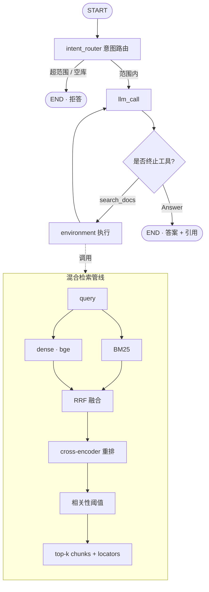

# docagent — 面向本地文档的 agentic RAG 问答

[English](README.md) | **中文**

针对一个真实文档语料用自然语言提问,得到**精确到来源位置**的带引用答案(文件+行号,或 PDF 页码)。基于 [LangGraph](https://langchain-ai.github.io/langgraph/),配有混合检索管线、量化评估、以及一个小型 Web UI。

自带知识库是一个聚焦主题:**现代 Python Web 开发** —— FastAPI 官方文档 + 它所依赖的 Python 类型/异步 PEPs,横跨 **Markdown、reStructuredText、PDF** 三种格式(127 篇文档 / 约 1.25k chunks)。

## 特性

- 🔁 **Agentic 检索** —— 检索、检查、改写、再检索,然后作答。
- 🧪 **混合检索 + 重排** —— dense(bge)**+** BM25 经 RRF 融合,再 cross-encoder 重排,再相关性阈值过滤(也是它能说"文档里没有"的机制)。
- 🗂️ **多格式** —— Markdown / reStructuredText / PDF 同处一个知识库,每条引用带正确 locator(`file.md:L10-30` 或 `file.pdf (p.3)`)。
- 📎 **可验证的引用** —— `Answer` 工具**强制**附带引用,且每条都会**对照实际检索到的内容校验**;未支撑的(幻觉)locator 会被丢弃,而非盲信。
- 🧭 **意图路由**、🔭 **检索 trace**(`--trace`)、🛡️ **健壮性**(空库/工具失败/递归守卫)。
- 📊 **量化评估** —— 意图/召回/答案/引用/拒答。
- 💬 **Web UI** —— 小型 FastAPI + 静态聊天前端。
- 🔒 检索全程**本地 embedding、无需 API key**;只有作答 LLM 需要 key。

## 架构



## 快速开始

```bash
# 1. 环境（Python 3.11）
conda create -n docagent python=3.11 -c conda-forge
conda activate docagent
pip install -e .          # extras：".[dev]" 测试/lint · ".[cli]" langgraph dev · ".[corpus]" 重建 PDF

# 2. 配置作答 LLM
cp .env.example .env          # 把 OPENAI_API_KEY 填进 .env（或 LLM_MODEL=ollama:llama3.1）

# 3. 构建语料（FastAPI 文档 + PEPs + 一个 PDF）并建立索引
python scripts/build_corpus.py
python -m docagent.ingest --path ./corpus --reset

# 4a. 命令行提问
python -m docagent.ask --trace "How do I declare an integer path parameter?"

# 4b. …或启动 Web UI
python -m docagent.web        # 打开 http://127.0.0.1:8000
```

把 `ingest --path` 指向任意装有你自己 `.md` / `.rst` / `.txt` / `.pdf` 的文件夹,即可针对自己的文档建库。

## Web UI


小型聊天前端(FastAPI 后端 + 静态 Tailwind 页面),展示答案、意图徽章、引用 chips、可折叠的检索 trace:

```bash
python -m docagent.web   # http://127.0.0.1:8000
```

API:`POST /api/ask {question}` → `{kind, intent, answer, question, citations, unsupported, trace}`,`GET /api/sources` → 文档列表。

## 运行示例

**跨格式检索**(探针,无需 key —— `python scripts/check_retrieval.py`):

```console
Q: What does PEP 484 specify about type hints?
   pep-0484.rst:L1-25                 score= 5.42  'PEP: 484 Title: Type Hints ...'
Q: What are protocols and structural subtyping?
   pep-0544-protocols.pdf (p.1)       score= 5.07  'PEP: 544 Title: Protocols: Structural subtyping ...'
Q: What is the capital of France?
   (no chunk passed the relevance threshold)
```

**范围内问题**(CLI):

```console
$ python -m docagent.ask --trace "How do I declare a path parameter that must be an integer, and what does FastAPI do if the client sends a non-integer?"
🔎 Intent: IN_SCOPE — retrieving from knowledge base
=== trace ===
  1. search_docs  query='FastAPI path parameter integer non-integer validation'

=== Answer ===
Declare the path parameter with a Python type annotation, e.g. `item_id: int`.
FastAPI validates it and returns a validation error for a non-integer
[tutorial-path-params.md:L65-91].

=== Citations ===
- tutorial-path-params.md:L65-91
```

## 语料

聚焦主题、多格式、可复现:

| 来源 | 格式 | 数量 | 许可 |
|---|---|---|---|
| FastAPI 文档(tutorial / advanced / how-to / deployment） | Markdown | 119 | MIT |
| Python PEPs（484, 492, 8, 257, 20, 585, 604） | reStructuredText | 7 | PSF |
| PEP 544（Protocols）转 PDF | PDF | 1 | PSF |

随时用 `python scripts/build_corpus.py` 重建(attribution 见 `corpus/SOURCE.md`)。

## 检索管线

`search_docs` 不是朴素 top-k 余弦。对每个查询:**dense**(`bge-small-en-v1.5`)+ **BM25** → **RRF 融合** → **cross-encoder 重排**(`ms-marco-MiniLM-L-6-v2`)→ **相关性阈值**。每个保留 chunk 带精确 locator 用于引用。

## 评估

带标注的 QA 集(`src/docagent/eval/qa_dataset.py`)覆盖 单文档、多跳、超范围、无答案 四类:

```bash
python -m docagent.eval.run_eval
```

在自带语料(约 1.25k chunks / 126 文档)、作答 LLM `gpt-5.4-mini` 上的最新结果:

| 指标 | 结果 |
|---|---|
| 意图路由准确率 | **10/10 (100%)** |
| 检索召回(均值) | **0.94** |
| 答案正确率(LLM 评判) | **7–8/8 (88–100%,逐次略有波动)** |
| 引用准确率 | **8/8 (100%)** |
| 幻觉引用 | **0**（每条引用都对照检索校验） |
| 拒答准确率 | **2/2 (100%)** |

幻觉引用:**0** —— 每条引用都对照实际检索内容校验过。语料扩大 6 倍（206 → 约 1.25k chunks）时检索质量保持。这是一个小型、单领域验证集:用于检验管线,**不**证明通用规模能力(见 [局限](#局限))。

## 局限

这是作品集级的本地文档 RAG,不是生产系统。已知局限:

- **语料规模** —— 检索器启动时把全部 chunk 载入内存并构建 BM25。本地知识库(≤ 约 1 万 chunks)没问题;10⁵–10⁶ 量级需要服务端稀疏索引 + 懒加载。
- **引用校验是文件级** —— 引用对照检索到的 locator 校验(按文件,精确 locator 命中时也按 locator),尚未逐句验证答案是否被引用片段蕴含。
- **多跳** —— 需同时用两个文档的问题是主要准确率短板;子查询拆解是后续工作。
- **评估集小且单领域**(Python web 文档 10 例)—— 足以检验管线,不足以宣称广泛泛化。

## 目录结构

```
src/docagent/
├── agent.py            # LangGraph：intent_router + 应答循环 + trace/守卫
├── retriever.py        # 混合检索：dense+BM25 -> RRF -> 重排 -> 阈值
├── ingest.py           # 加载 -> 切块(带行号/页码出处) -> 向量化 -> Chroma
├── ask.py / web.py     # CLI / FastAPI+静态 Web UI
├── static/index.html   # 聊天前端（Tailwind）
├── vectorstore.py, configuration.py, prompts.py, schemas.py
├── tools/              # search_docs, list_sources, Answer, Question
└── eval/               # qa_dataset.py + run_eval.py
corpus/{fastapi,peps,pdf}/   # 聚焦主题的多格式示例语料
scripts/                # build_corpus.py, check_retrieval.py, check_web.py
tests/                  # 检索测试（无需 key）+ LLM 端到端测试
```

## 测试

```bash
python tests/run_all_tests.py          # 仅检索测试（无需 API key）
python tests/run_all_tests.py --all    # + LLM 端到端（需要 API key）
```

## 配置

`.env` 中关键项(见 `.env.example`):`OPENAI_API_KEY`、`LLM_MODEL`(默认 `openai:gpt-4.1`;任意 `init_chat_model` id)、`EMBEDDING_MODEL`(`BAAI/bge-small-en-v1.5`)、`RERANKER_MODEL`(`cross-encoder/ms-marco-MiniLM-L-6-v2`)、`TOP_K`/`CANDIDATE_K`(`4`/`20`)、`SCORE_THRESHOLD`(`0.0`)、`CHROMA_PATH`/`CHROMA_COLLECTION`、`CHUNK_SIZE`/`CHUNK_OVERLAP`。

## 技术栈

LangGraph · LangChain · Chroma · sentence-transformers (bge) · rank-bm25 · cross-encoder · pypdf · FastAPI · Tailwind

## 许可证

MIT（本项目）。`corpus/` 下的示例语料再分发了 FastAPI 文档(MIT)与 Python PEPs(PSF)—— 见 `corpus/SOURCE.md`。
